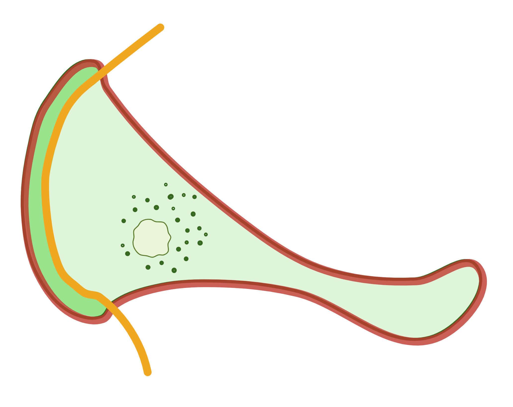

# CellSplitterForRuffles

This directory stores the code for cell_splitter plugin for ImageJ.

## Input image requirements

* This extension has been tested to work successfully on .lcm and .czi files formats
* After being imported, images should have 3 slices in the following order:
    * Target gene
        * This slice will be used by the defined ROI to measure light signal intensities as indicators for
          gene-of-interest expression
    * Actin
        * This slice is used to distinguish ruffles and other parts of the body
    * DAPI
        * This slice is not required as it will not be used

## Installation & use

1. Download the `cell_splitter.js` file locally from this GitHub page and rename the file's extension to `GEVALIris.ijm`
1. From ImageJ -> Plugins -> Macros -> Install to install this `cell_splitter.ijm`
1. Drag and drop an image file (preferred in the format of `.lcm` or `.czi`) into ImageJ
1. In the menu of `Bio-Formats Import Options`, for the `View stack with` field, ensure to use the `Standard ImageJ`
   option
1. From ImageJ -> Plugins -> Macros, you can see all the installed macros with the corresponding shortcut key in `[]`
    * For common use, run `auto_everything` or press `Z`
    * For debugging in a step-by-step manner, run each macro or press the corresponding key in order
1. Enjoy your high-speed analysis!

## Code behaviour explanation

1. After pressing `Z`, the code automatically adjust the images and move the actin channel

2. It asks the user to use the freehand shape tool to trace out the whole cell area and this gives <code style="color : red">whole_cell</code> $${\color{test}Red}$$

3. It asks the user to use the freehand line tool to trace the boarder between the ruffles and other part of the cell.
   That boarder line is <code style="color : orange">line_ruffles</code> 
    * Ensure that the terminus of the line go outside the closed shape for cell

4. With <code style="color : orange">line_ruffles</code> selected, Edit → Selection → Properties and set the width as 1 px
1. Edit → Selection → Line to area and this gives <code style="color : purple">line_ruffles_area</code>  

6. With <code style="color : red">whole_cell</code> and <code style="color : purple">line_ruffles_area</code> selected, apply XOR and split the resulting ROI. In the multiple resulting
   ROI from the split, the one with the largest area is <code style="color : blue">non_ruffles</code>
   * XOR works by removing the area that 2 sets are overlapping and keep the ones that aren't overlapped 

7. With <code style="color : red">whole_cell</code> and <code style="color : blue">non_ruffles</code> selected, apply XOR and this gives <code style="color : blue">ruffles</code>
    * I did this because the previous step will make <code style="color : orange">line_ruffles</code> a gap so you will lose some pixels covered by <code style="color : orange">line_ruffles</code>. In this
      way, there’s no pixels lost
    * This also means that pixels from <code style="color : orange">line_ruffles</code> will be included in <code style="color : blue">ruffles</code>. Consequently, user should draw the
      <code style="color : orange">line_ruffles</code> adjacent to but also inside the <code style="color : blue">ruffles</code>'s edge that's facing the <code style="color : blue">non_ruffles</code>
      * This is usually not an issue since the code set the width of <code style="color : orange">line_ruffles</code> to 1 px. If you're using a way bigger px as the width, this should be taken care of by suggestions above

8. All ROI are saved locally
1. The intensities within <code style="color : red">whole_cell</code> , <code style="color : blue">non_ruffles</code>, and <code style="color : blue">ruffles</code> are measured on the slices for target gene and
   actin
    * As a sanity check, the same ROI on different channels should be measured as the same area. The sum of <code style="color : blue">ruffles</code>'s area and <code style="color : blue">non_ruffles</code>'s area should be equal to <code style="color : red">whole_cell</code>'s area
1. <code style="color : blue">non_ruffles</code> and <code style="color : blue">ruffles</code> are overlaid on the actin channel and save as a new image for quality check and records 

