# CellSplitterForRuffles

Cell margins are closely associated with cell migration and morphological changes. In cancer biology, they represent
regions where cellular protrusions occur and are strongly linked to malignancy and invasiveness. This makes them a
critical focus for investigations. However, the most commonly used software for image analysis in cancer biology,
ImageJ, lacks a dedicated tool to separate cell margins of interest from the rest of the cell. To address this need, I
developed this plugin that enables users to accurately isolate and analyze multiple cell margin regions from the rest of
the cell body.

## Input image requirements

* This extension has been tested to work successfully on .lcm and .czi files formats
* After being imported, images should have 3 slices in the following order:
    * Target gene
        * This slice will be used by the defined ROI to measure light signal intensities as indicators for
          gene-of-interest expression
    * Actin
        * This slice is used to distinguish ruffles and other parts of the body
    * DAPI
        * This slice is not required as it will not be used

## Installation & use

1. Download the `cell_splitter.js` file locally from this GitHub page and rename the file's extension to `GEVALIris.ijm`
1. From ImageJ -> Plugins -> Macros -> Install to install this `cell_splitter.ijm`
1. Drag and drop an image file (preferred in the format of `.lcm` or `.czi`) into ImageJ
1. In the menu of `Bio-Formats Import Options`, for the `View stack with` field, ensure to use the `Standard ImageJ`
   option
1. From ImageJ -> Plugins -> Macros, you can see all the installed macros with the corresponding shortcut key in `[]`
    * For common use, run `auto_everything` or press `Z`
    * For debugging in a step-by-step manner, run each macro or press the corresponding key in order
1. Enjoy your high-speed analysis!

## Code behaviour explanation

### ROI generated and saved

ROI below whose names contain __NUMBER__ means there can be multiple of them

* <code style="color : red">whole_cell</code> (${\textsf{\color{red}red}}$): the whole cell area
* <code style="color : orange">line_ruffles_raw_NUMBER</code> (${\textsf{\color{orange}orange}}$): the raw lines drawn
  by user to split and their 2 ends are outside the whole_cell
* <code style="color : purple">line_ruffles_raw_area_NUMBER</code> (${\textsf{\color{purple}purple}}$): area converted
  from line_ruffles_raw_NUMBER by `Edit → Selection → Line to Area` operation
* <code style="color : green">line_ruffles_area_NUMBER</code> (${\textsf{\color{green}green}}$):
  line_ruffles_raw_area_NUMBER truncated by whole_cell
* <code style="color : blue">non_ruffles</code> (${\textsf{\color{blue}blue}}$): determined area for non-ruffles
* <code style="color : blue">ruffles_NUMBER</code> (${\textsf{\color{blue}blue}}$): determined areas for ruffles

### Process

1. After pressing `Z`, the code automatically set up the output folder directory, rename slices, adjust the images for
   contrast, and move to the actin channel, ready for the next step
1. Code asks users to select out multiple areas as background using the rectangle tool.
    * Once a background area is
      selected, press `A` to add it onto the image
    * 3 background areas are enough but the user can add more
    * After the user clicks OK, these areas' intensities will be averaged to calculate out a value as the background
      intensity for that slice. Each slice's background intensity will be subtracted out from the whole slice for the
      background reduction purposes
    * Background areas' measurements are saved locally

   

   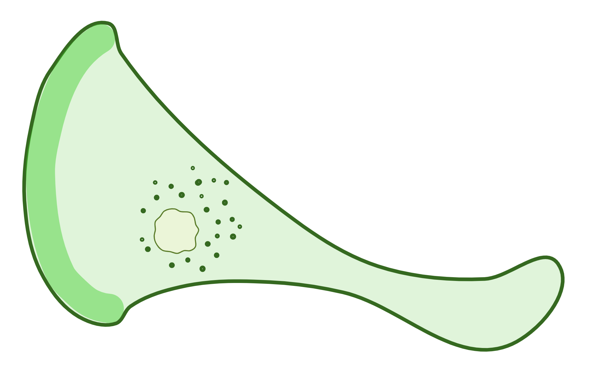
   

1. Code asks the user to use the freehand shape tool to trace out the whole cell area and this
   gives <code style="color : red">whole_cell</code> (${\textsf{\color{red}red}}$)

   

   
   

1. Code asks the user to use the freehand line tool to trace the boarders between the ruffles areas and other part of
   the cell. That boarder line is <code style="color : orange">
   line_ruffles_raw</code> (${\textsf{\color{orange}orange}}$). For
   simplicity, the diagram only shows 1 <code style="color : orange">
   line_ruffles_raw</code> (${\textsf{\color{orange}orange}}$), but the latest version allow user to trace multiples
   ones with `A` pressed to add
    * Ensure that the 2 ends of the line go outside the closed shape for cell
    * For the best performance, the <code style="color : orange">
      line_ruffles_raw</code> (${\textsf{\color{orange}orange}}$) should intersect with the outline
      of <code style="color : red">whole_cell</code> (${\textsf{\color{red}red}}$) at __90°__. If this angle is very
      acute, you'll have the risk of having very small part of the <code style="color : orange">
      line_ruffles_raw</code> (${\textsf{\color{orange}orange}}$) sticks to the children ROI generated from the split
      like a tail in the later step
        * Larger images tend to have lower risk of this issue since they are less granular
        * More discussed below for the function `bridge_diagonal_only_contacts()`

   

   
   

1. With <code style="color : orange">line_ruffles_raw</code> (${\textsf{\color{orange}orange}}$) selected, `Edit →
   Selection → Properties` and set the width as 1 px
    * The width shouldn't matter here but 1 px tends to give the best result
1. `Edit → Selection → Line to Area` and this gives <code style="color : purple">
   line_ruffles_raw_area</code> (${\textsf{\color{purple}purple}}$)

   

   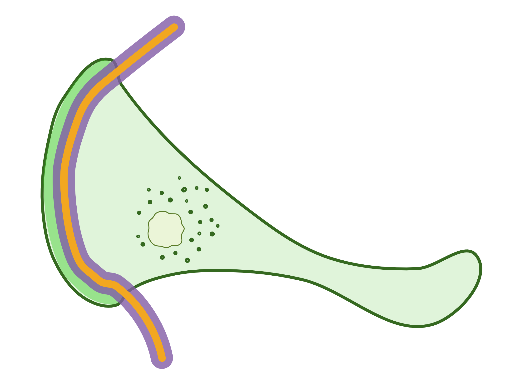
   
   

1. With <code style="color : red">whole_cell</code> (${\textsf{\color{red}red}}$) and <code style="color : purple">
   line_ruffles_raw_area</code> (${\textsf{\color{purple}purple}}$) selected, apply AND to
   truncate <code style="color : purple">
   line_ruffles_raw_area</code> (${\textsf{\color{purple}purple}}$) to only keep the parts that are inside the cell and
   fill in the bridging pixels (see notes below). This gives <code style="color : green">
   line_ruffles_area</code> (${\textsf{\color{green}green}}$)

   

   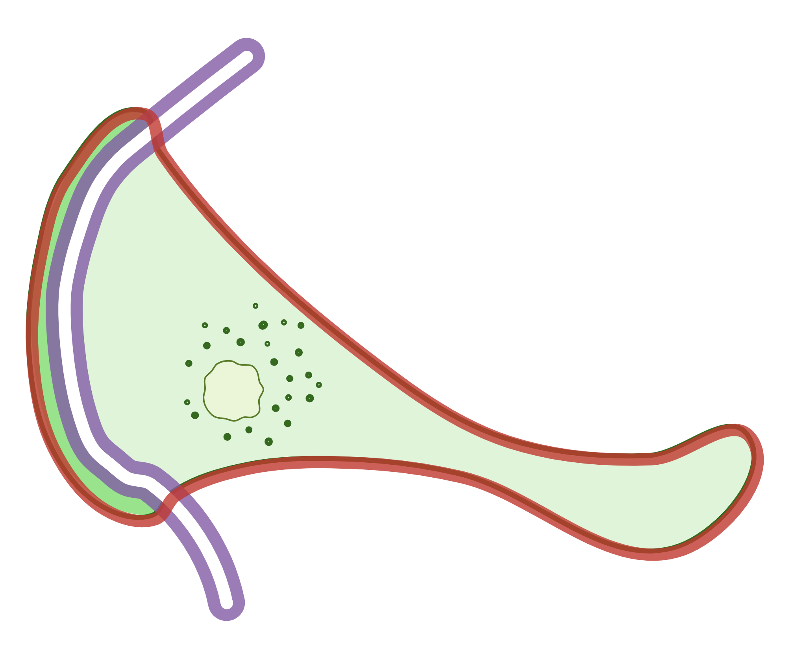
   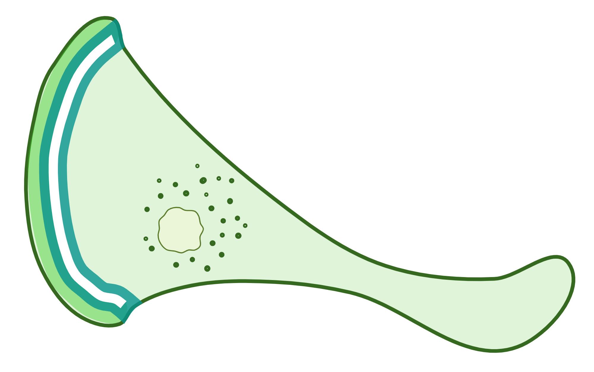
   

    * During this process, filling in the bridge pixels is necessary because <code style="color : purple">
      line_ruffles_raw_area</code> (${\textsf{\color{purple}purple}}$) are defined with __8-connectivity__ (2 pixels can
      be connected by any 4 sides or 4 points).
        * This can be an issue for the later logic operations and can lead to parts with small tails (see the yellow
          tails sticking out below). Tails are very narrow small areas.

       

       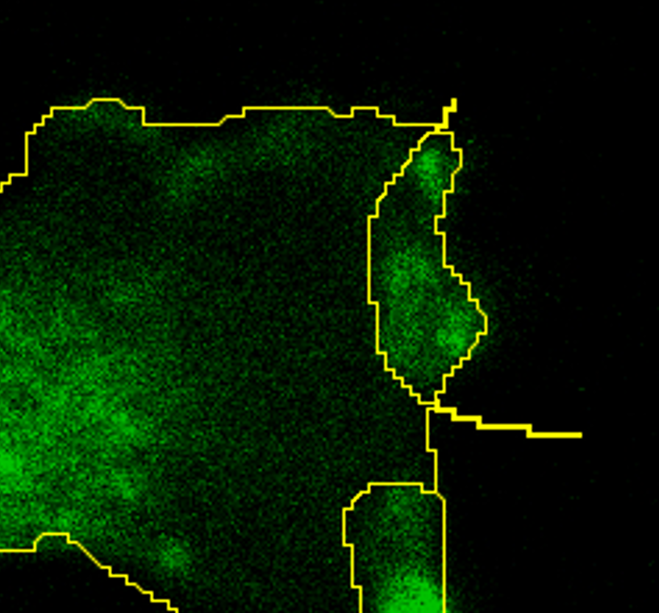
       

        * To solve this, I developed `bridge_diagonal_only_contacts()` to fill in 1 pixel to force all pixels to be _
          _4-connectivity__ (any 2 pixels must be connected by at least 1 side and cannot be connected by just a
          corner). Test cases are shown below for diagonal lines as masks, with red outlining the original pixels and
          blue outlining the filled in ones.
            * Technically, you can also use a 2 × 2 matrix to recognize the diagonal features, but ImageJ requires an
              odd number matrix, which means 3 × 3 matrix at minimum for calculation. To not overcomplicate the problem,
              `bridge_diagonal_only_contacts()` was written using relative coordinates with pixel color judgements.

       

       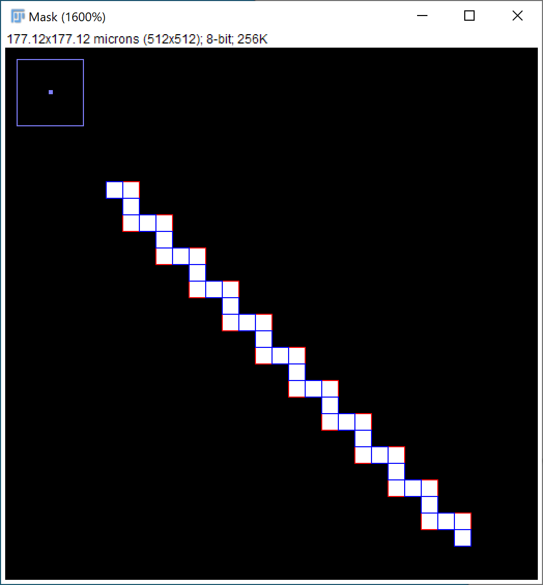
       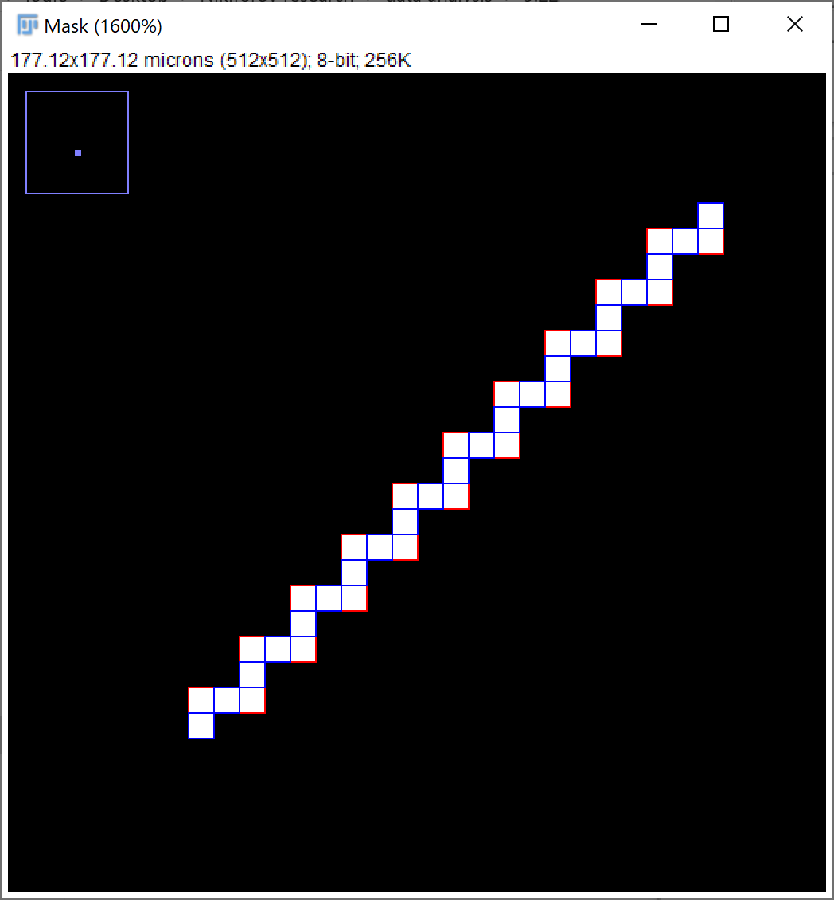
       

1. With <code style="color : red">whole_cell</code> (${\textsf{\color{red}red}}$) and <code style="color : green">
   line_ruffles_area</code> (${\textsf{\color{green}green}}$) selected, apply XOR and split the resulting ROI. In the
   multiple resulting
   ROI from the split, the one with the largest area is <code style="color : blue">
   non_ruffles</code> (${\textsf{\color{blue}blue}}$). This process will be repeated with all
   the <code style="color : green">line_ruffles_area</code> (${\textsf{\color{green}green}}$), keep chopping off
   the <code style="color : blue">non_ruffles</code> (${\textsf{\color{blue}blue}}$)
    * XOR works by removing the area that 2 sets are overlapping and keep the ones that aren't overlapped
    * Due to how this process works, if the original <code style="color : orange">
      line_ruffles_raw</code> (${\textsf{\color{orange}orange}}$) intersects with the <code style="color : red">
      whole_cell</code> (${\textsf{\color{red}red}}$) at a very sharp angle, the risk of having part of the line
      attached to the children ROI from the operation is higher

   

   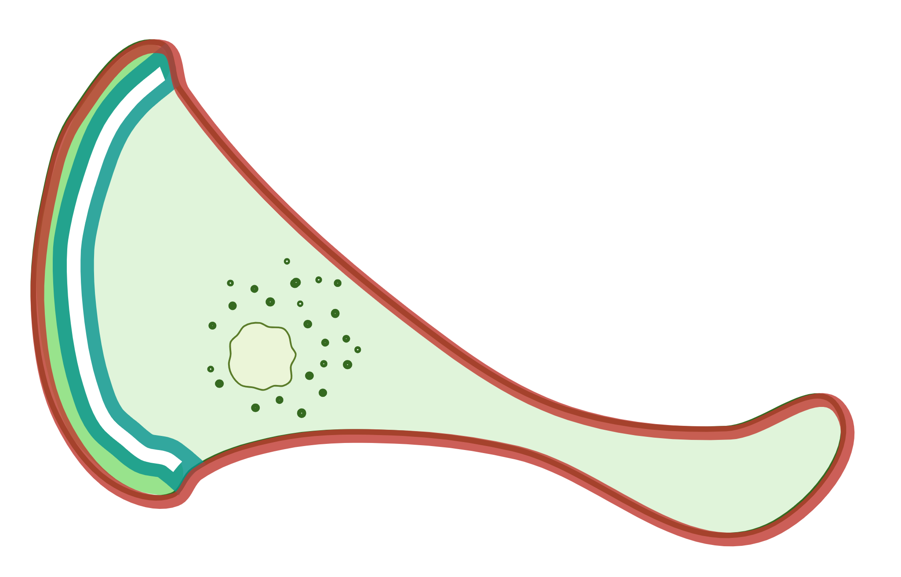
   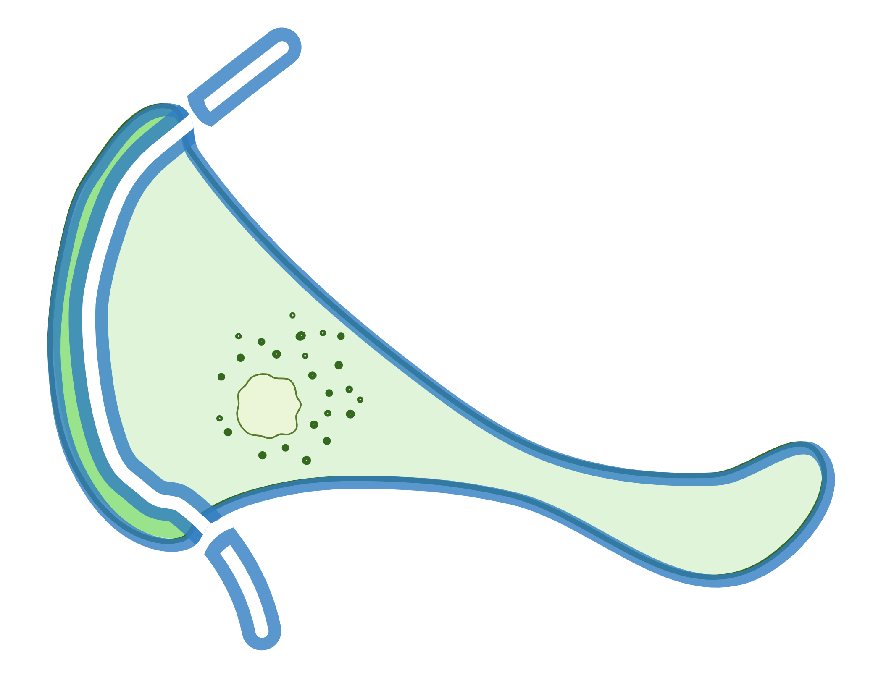
   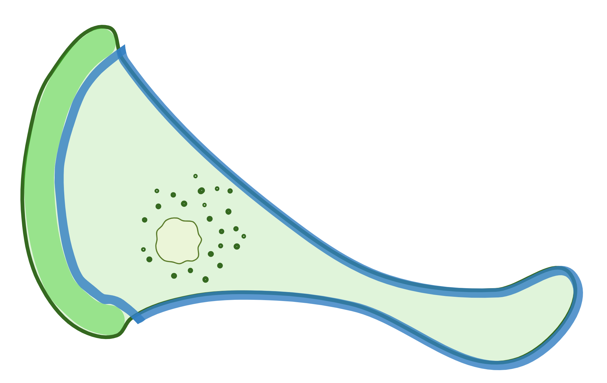
   

1. With <code style="color : red">whole_cell</code> (${\textsf{\color{red}red}}$) and <code style="color : blue">
   non_ruffles</code> (${\textsf{\color{blue}blue}}$) selected, apply XOR and this gives <code style="color : blue">
   ruffles</code> (${\textsf{\color{blue}blue}}$)
    * I do this because the previous step will make <code style="color : green">
      line_ruffles_area</code> (${\textsf{\color{green}green}}$) a gap so you will lose some pixels covered
      by it. In this
      way, there’s no pixels lost
    * This also means that pixels from <code style="color : green">
      line_ruffles_area</code> (${\textsf{\color{green}green}}$) will be included in <code style="color : blue">
      ruffles</code> (${\textsf{\color{blue}blue}}$). Consequently, user should draw the
      <code style="color : orange">line_ruffles_raw</code> (${\textsf{\color{orange}orange}}$) adjacent to but also
      inside
      the edge of <code style="color : blue">ruffles</code> (${\textsf{\color{blue}blue}}$) that's facing
      the <code style="color : blue">non_ruffles</code> (${\textsf{\color{blue}blue}}$)
        * This is usually not an issue since the code set the width of <code style="color : orange">
          line_ruffles_raw</code> (${\textsf{\color{orange}orange}}$) to 1 px. If you're using a way bigger px as the
          width,
          this should be taken care of by suggestions above

   

   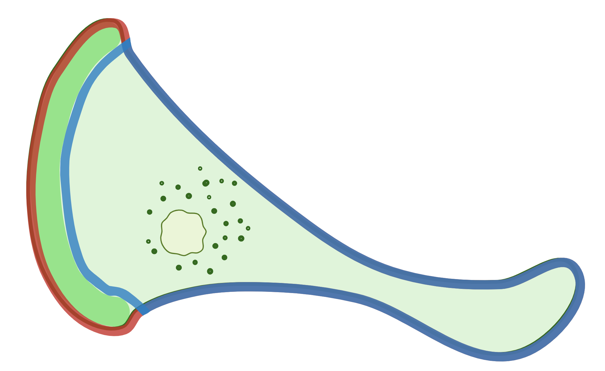
   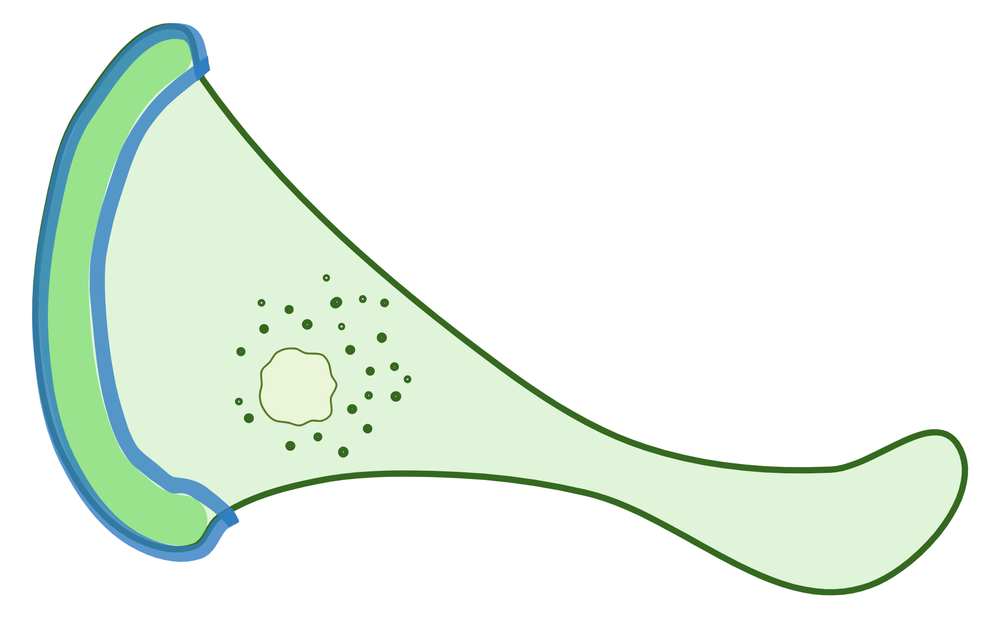
   

1. All ROI are saved locally
1. The intensities within <code style="color : red">
   whole_cell</code> (${\textsf{\color{red}red}}$), <code style="color : blue">
   non_ruffles</code> (${\textsf{\color{blue}blue}}$), and <code style="color : blue">
   ruffles</code> (${\textsf{\color{blue}blue}}$) are measured on the slices for target gene and
   actin
    * As a sanity check, the same ROI on different channels should be measured as the same area. The sum of the areas
      of <code style="color : blue">ruffles</code> (${\textsf{\color{blue}blue}}$) and <code style="color : blue">
      non_ruffles</code> (${\textsf{\color{blue}blue}}$) should be equal to the area of <code style="color : red">
      whole_cell</code> (${\textsf{\color{red}red}}$)
1. <code style="color : blue">non_ruffles</code> (${\textsf{\color{blue}blue}}$) and <code style="color : blue">
   ruffles</code> (${\textsf{\color{blue}blue}}$) are overlaid on the actin channel and the target gene channel,
   respectively. Both overlaid images are saved for quality
   check and records
    * Now you can see that <code style="color : blue">non_ruffles</code> (${\textsf{\color{blue}blue}}$)
      and <code style="color : blue">ruffles</code> (${\textsf{\color{blue}blue}}$) share the same dividing line, which
      was the edge of <code style="color : blue">non_ruffles</code> (${\textsf{\color{blue}blue}}$) that faces the
      ruffles area
    * You can also see that the pixels covered by the original <code style="color : orange">
      line_ruffles_raw</code> (${\textsf{\color{orange}orange}}$) now becomes part of the <code style="color : blue">
      ruffles</code> (${\textsf{\color{blue}blue}}$). This is the reason why user should draw
      the <code style="color : orange">line_ruffles_raw</code> (${\textsf{\color{orange}orange}}$) on the edge of but
      still
      within the area of <code style="color : blue">ruffles</code> (${\textsf{\color{blue}blue}}$)

   

   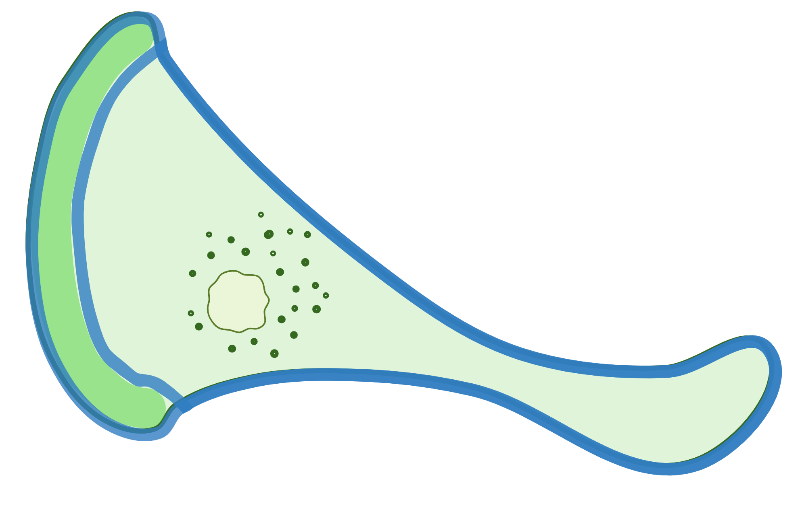
   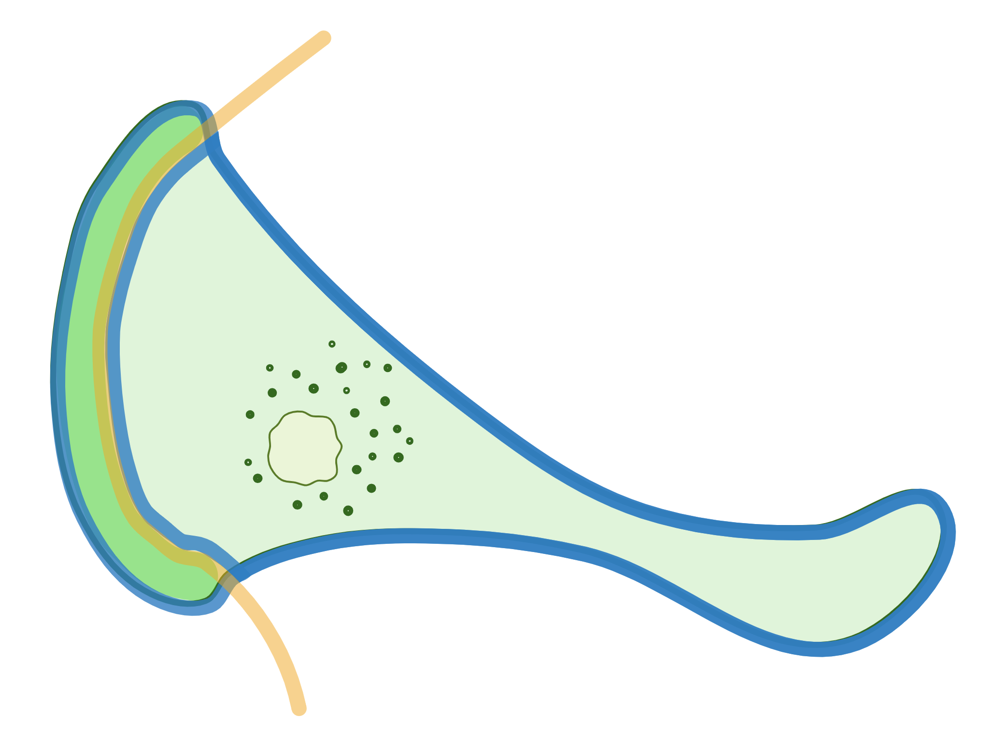
   

1. Processed stack is saved locally for quality check later if needed

## Troubleshooting

When the `whole_cell` area is drawn in a way that the user lifts the pen before it reaches to the end, a straight line
will automatically form. This is totally fine for defining the whole cell area, but if a `line_ruffles_raw` is drawn
across that straight line, it leads to unseparate shapes sometimes (not always happens but does increase the risk).

* Solution: draw the `whole_cell` area as much as possible and only draw `line_ruffles_raw` across the `whole_cell` on
  the lines that were manually drawn